#  Real-Time Infrastructure Monitoring & Alerting using Prometheus & Grafana

---

## ➤ Project Overview

This project implements a **real-time infrastructure monitoring and alerting system** using Prometheus and Grafana on AWS EC2.

Previously, server health (CPU, memory, disk) was monitored manually using SSH. This solution automates monitoring by providing **live dashboards and proactive alerts**, helping detect issues before they impact system availability.

---

## ➤ Objective

- Monitor multiple EC2 instances in real time  
- Collect and store system metrics centrally  
- Visualize infrastructure health using dashboards  
- Trigger alerts when thresholds are exceeded  
- Enable email notifications for critical alerts  

---

## ➤ Architecture Diagram
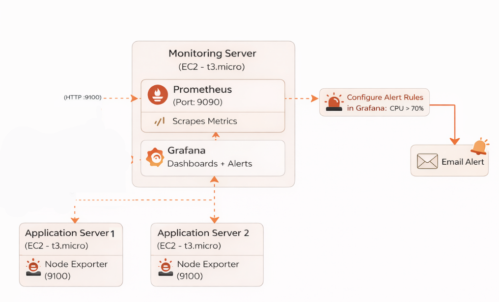

---

## ➤ Architecture & Workflow

1. Node Exporter runs on application servers and exposes system metrics  
2. Prometheus (monitoring server) scrapes metrics from all servers  
3. Grafana connects to Prometheus to visualize data  
4. Alert rules evaluate metrics continuously  
5. Email notifications are sent when alerts are triggered  

---

## ➤ Tech Stack

- AWS EC2  
- Prometheus  
- Grafana  
- Node Exporter  

---

## ➤ Infrastructure Setup

### 🔹 Monitoring Server (1 EC2)
- Installed:
  - Prometheus
  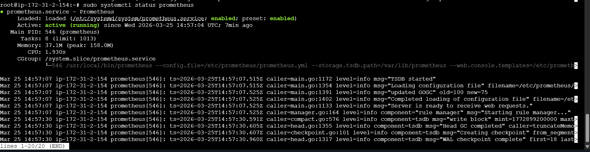  
  - Grafana  
  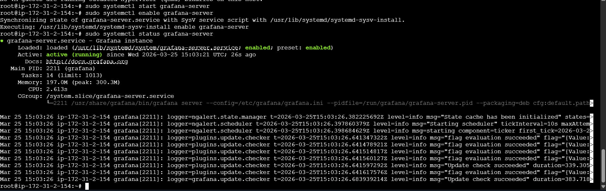

### 🔹 Application Servers (2 EC2)
- Installed:
  - Node Exporter 
  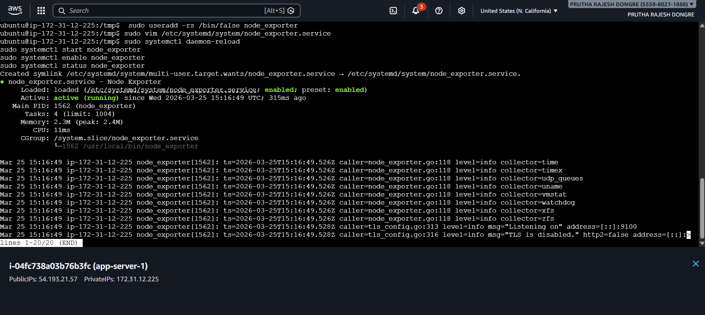
  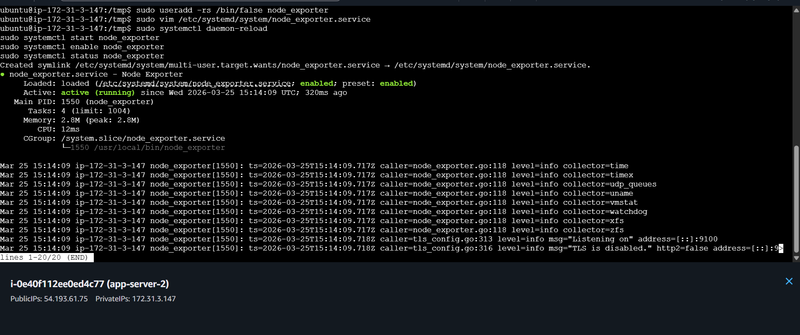

### Instances for this project
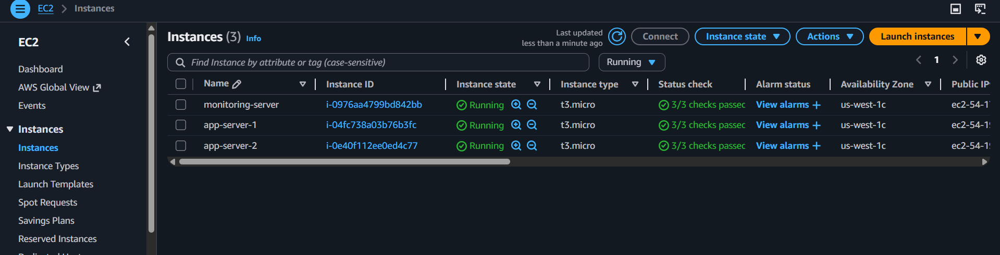

---

## ➤ Prometheus Configuration
Configure Prometheus to Scrape Node Exporter
- Edit configuration:
```
sudo vim /etc/prometheus/prometheus.yml
```


```yaml
scrape_configs:
  - job_name: "prometheus"
    static_configs:
      - targets: ["localhost:9090"]

  - job_name: "node_exporter"
    static_configs:
      - targets:
          - "<APP_SERVER_1_IP>:9100"
          - "<APP_SERVER_2_IP>:9100"
```
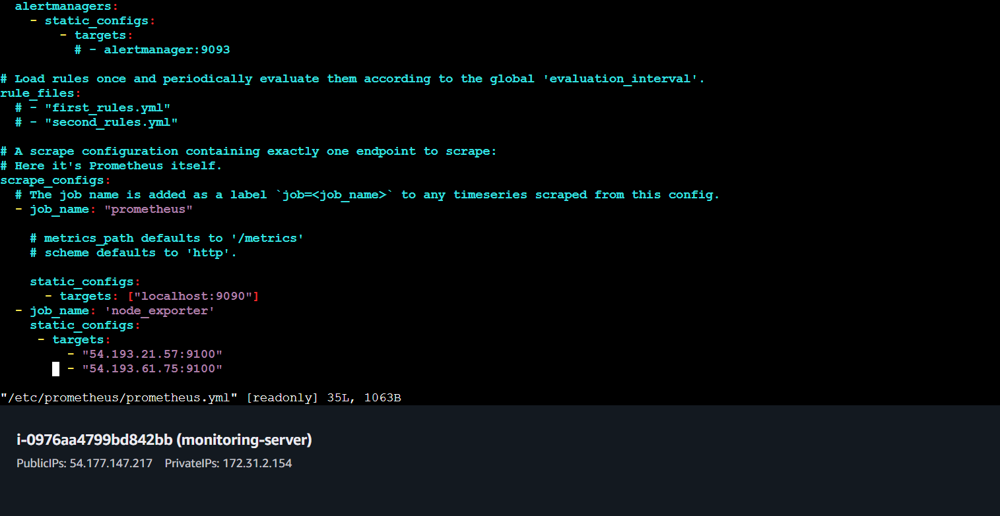

- Restart Prometheus:
```
sudo systemctl restart prometheus
```

---

## ➤ Grafana Dashboard

- Added Prometheus as a data source  
- Imported Node Exporter Full Dashboard (ID: 1860)  
  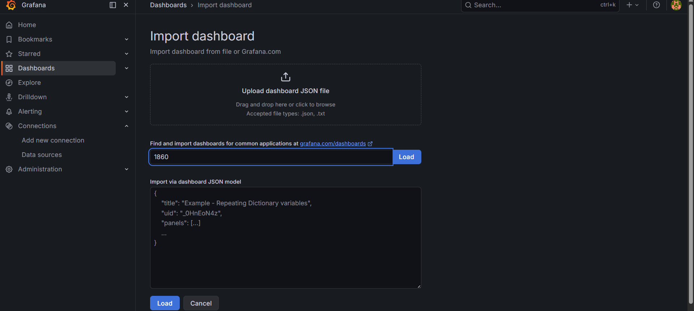
- Grafana dashboard 
  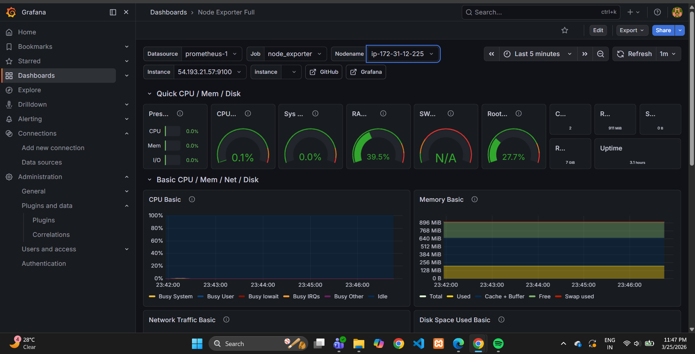

---

## ➤ Alerting

- Configured alert rule:
  - Condition: CPU usage > 70%  
  - Evaluation interval: 1 minute  
  - Pending duration: 1 minute 
  - Add Alert Query (PromQL)

    ```promql
    100 - (avg by(instance)(rate(node_cpu_seconds_total{mode="idle"}[1m])) * 100)
    ```
 
  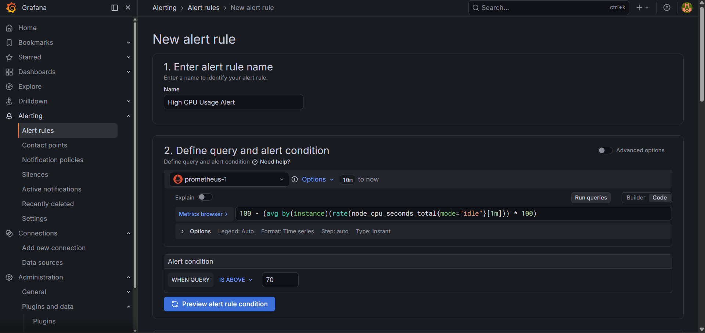

## ➤ Email Notification Setup

- Configured SMTP in Grafana using Gmail 
  - Edit file:
    ```
    sudo vim /etc/grafana/grafana.ini
    ``` 
  - Find [smtp] section and update:
    ```
    [smtp]
    enabled = true
    host = smtp.gmail.com:587
    user = your-email@gmail.com
    password = your-app-password
    from_address = your-email@gmail.com
    from_name = Grafana
    skip_verify = true
    ```
    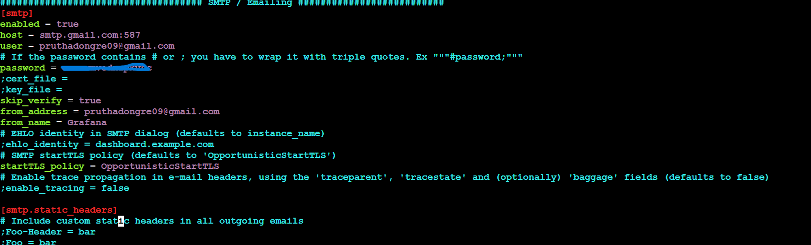

- Used App Password from your gmail for authentication 
- Restart Grafana
  ```
  sudo systemctl restart grafana-server
  ```

- Enabled email alerts for notifications  

- Select contact-point 
  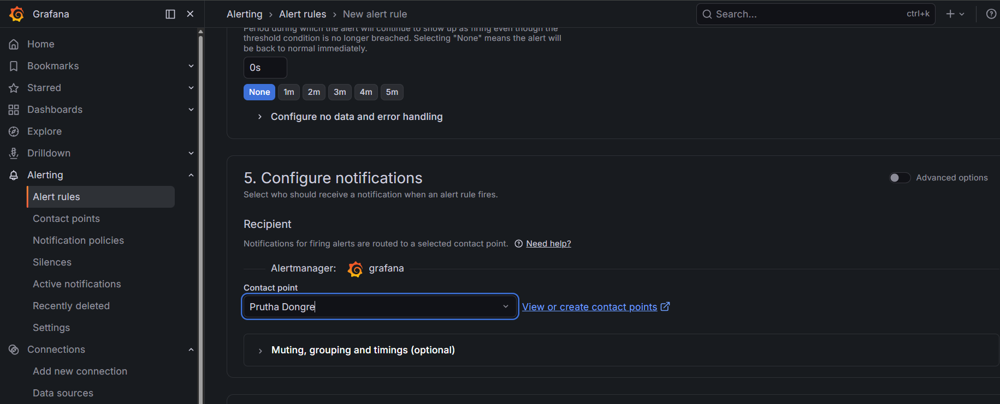

- Alert Rule is Configured now

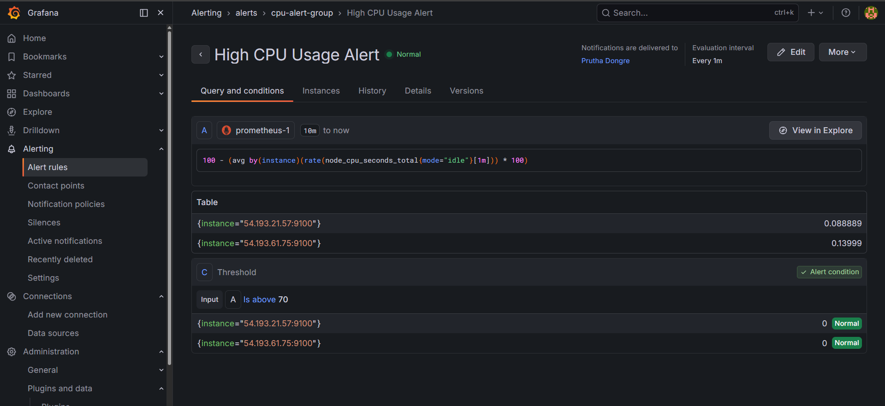


## ➤ Testing

- Simulated high CPU load:
  ```
  for i in {1..10}; do yes > /dev/null & done
  ```
  

- Check Grafana Dashboard to see increasing cpu load
  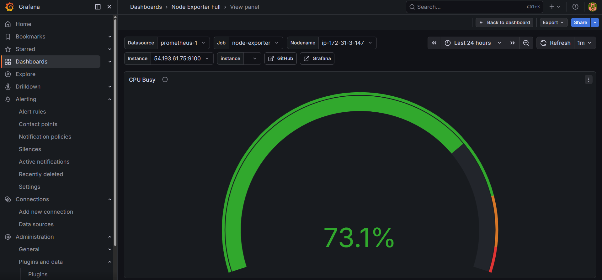

- Check Alert Dashboard to see Firing alarm
  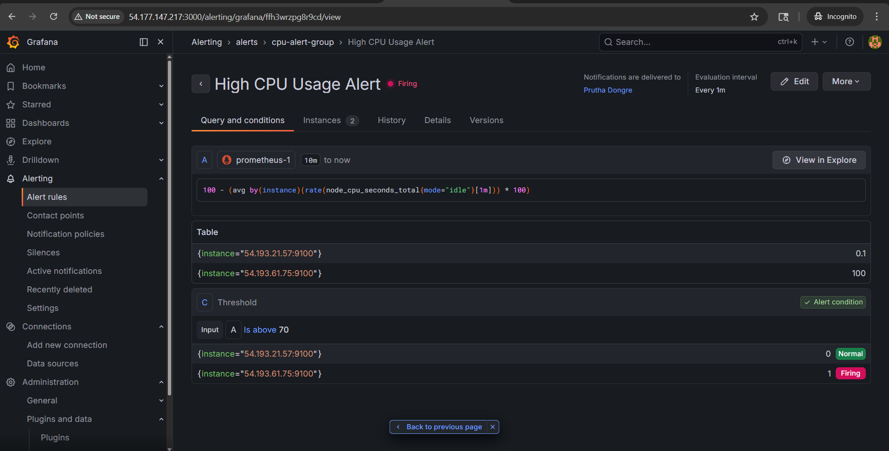

- Check Email Notifications

  - Mail for CPU high usage alert
    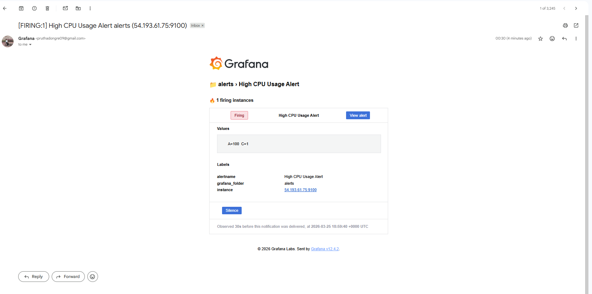


- Stopped load:
  ```
  killall yes
  ```
  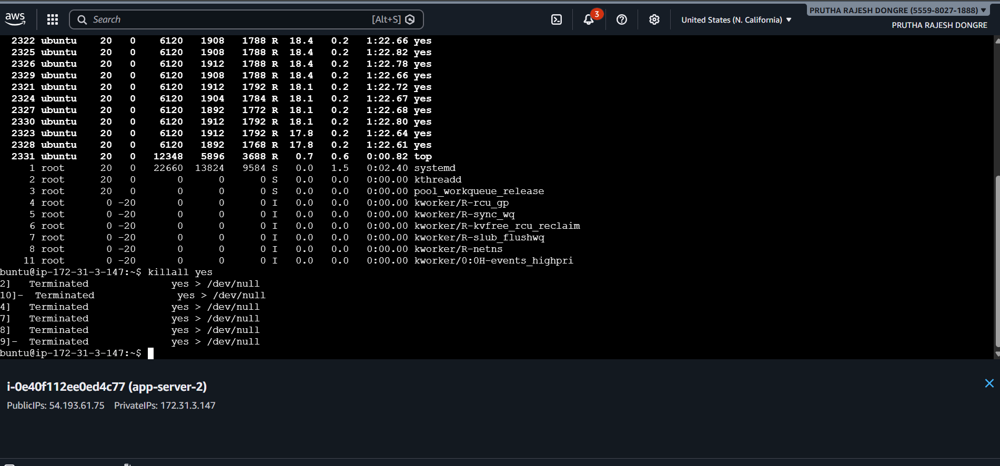

- Check Grafana Dashboard to see increasing cpu load
  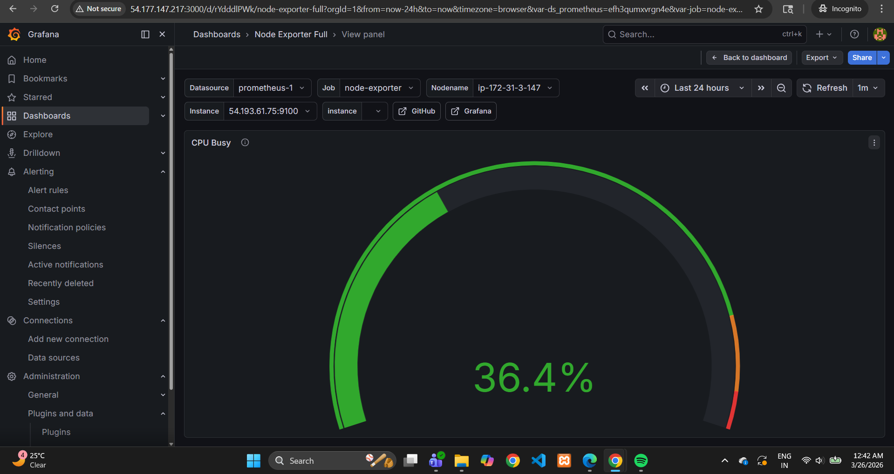

- Check Alert Dashboard to see normal state of instance
  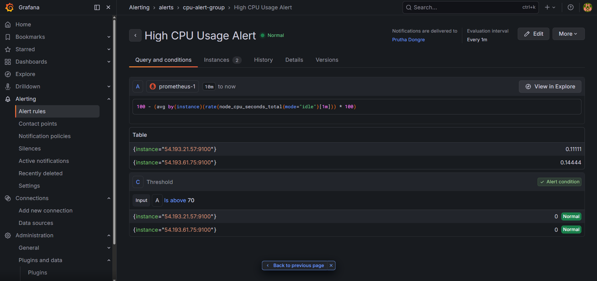
 
- Check Email Notifications
  - Mail for CPU usage comes below threshold
    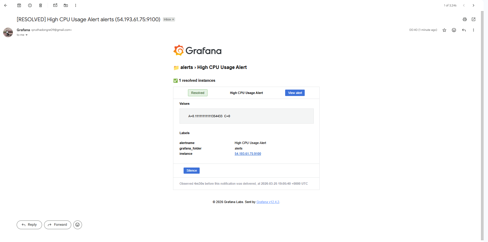

---

## ➤ Key Learnings
Built a complete monitoring system from scratch
Learned real-time infrastructure monitoring concepts
Gained hands-on experience with PromQL queries
Configured alerting and notification systems
Debugged real-world monitoring issues

---

## ➤ Outcome

Successfully created a system that:

Replaces manual server checks
Provides real-time visibility
Detects issues proactively
Sends automated email alerts
Improves system reliability

---

## ➤ Summary

This project demonstrates the implementation of a real-time infrastructure monitoring and alerting system using Prometheus and Grafana on AWS EC2. System metrics such as CPU, memory, and disk usage are collected from multiple servers and visualized through interactive dashboards.

A threshold-based alerting mechanism is configured to detect high CPU usage and trigger automated email notifications, enabling proactive issue detection. This solution eliminates manual monitoring, improves system visibility, and enhances overall reliability.

---
